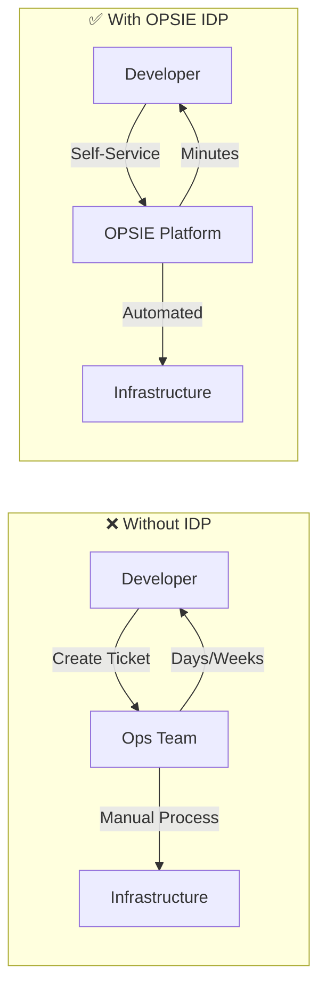
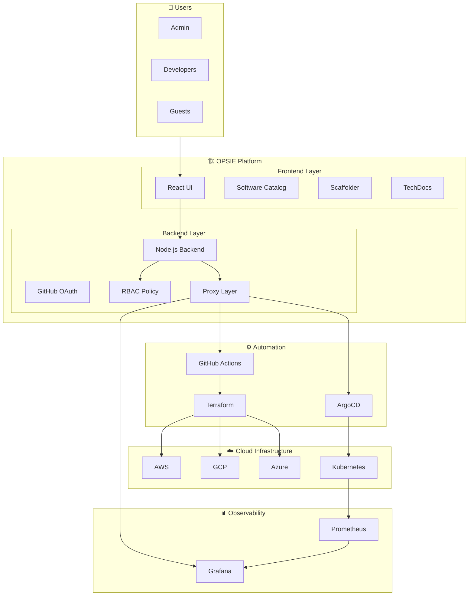
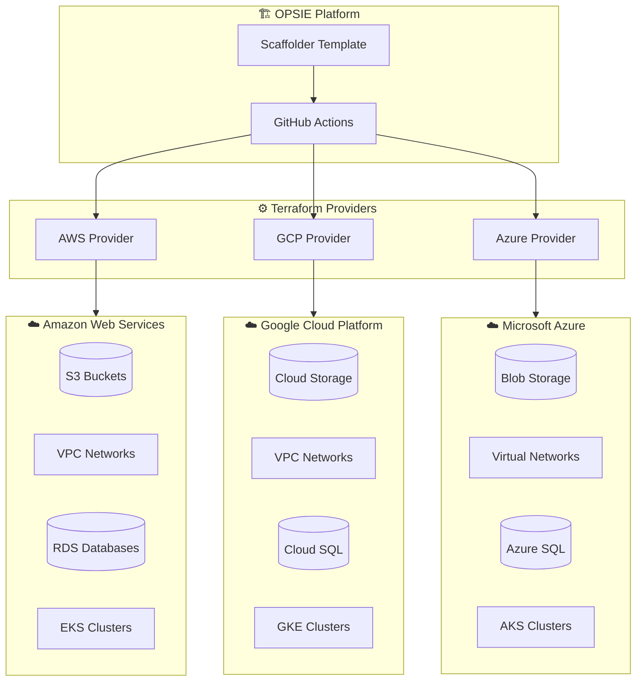
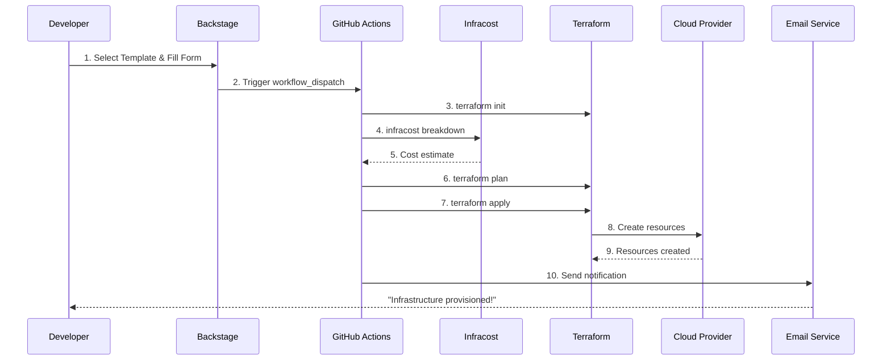
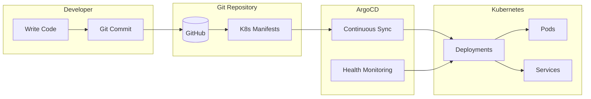
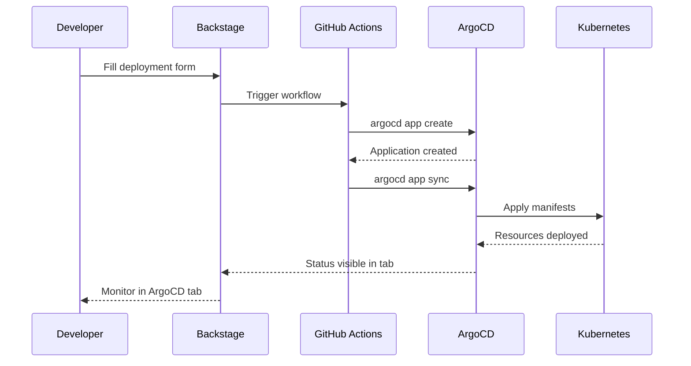
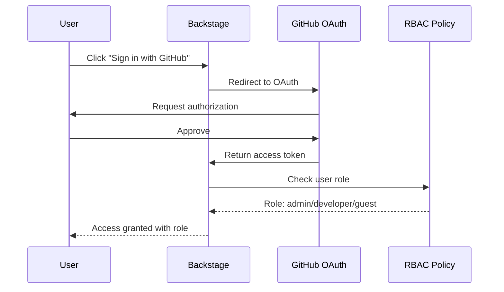
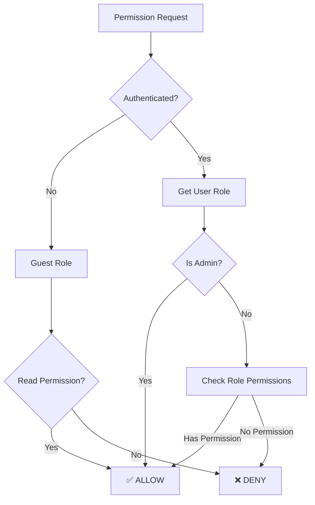
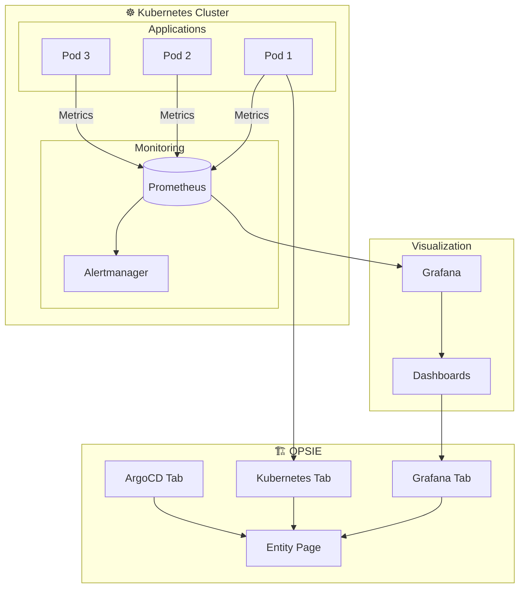

# 🚀 OPSIE - Internal Developer Platform

A production-grade **Internal Developer Platform (IDP)** built with [Backstage](https://backstage.io/), enabling self-service multi-cloud infrastructure provisioning, GitOps deployments, Kubernetes workload visibility, and integrated observability.


---

## 📋 Table of Contents

- [Features Overview](#-features-overview)
- [Platform Architecture](#-platform-architecture)
- [Multi-Cloud Infrastructure](#-multi-cloud-infrastructure)
- [Self-Service Templates](#-self-service-templates)
- [GitOps & ArgoCD](#-gitops--argocd)
- [Role-Based Access Control](#-role-based-access-control)
- [Observability Stack](#-observability-stack)
- [Getting Started](#-getting-started)
- [Configuration Reference](#-configuration-reference)

> 📚 **Full Technical Documentation**: See [docs/ARCHITECTURE.md](docs/ARCHITECTURE.md) for comprehensive implementation details.

---

## ✨ Features Overview

### Core Capabilities

| Feature                         | Description                                                   | Status    |
| ------------------------------- | ------------------------------------------------------------- | --------- |
| **Multi-Cloud Provisioning**    | Provision infrastructure across AWS, GCP, Azure via Terraform | ✅ Active |
| **Self-Service Infrastructure** | S3, VPC, RDS through a developer-friendly UI                  | ✅ Active |
| **Role-Based Access Control**   | GitHub OAuth + custom RBAC policy                             | ✅ Active |
| **GitOps Deployments**          | Deploy K8s apps via ArgoCD templates                          | ✅ Active |
| **Cost Estimation**             | Infracost shows monthly costs before provisioning             | ✅ Active |
| **Email Notifications**         | Automated Gmail alerts for all events                         | ✅ Active |
| **Resource Tagging**            | Governance tags (owner, cost center)                          | ✅ Active |
| **Grafana Observability**       | Embedded dashboards in entity pages                           | ✅ Active |
| **Kubernetes Integration**      | Pod/service visibility per component                          | ✅ Active |
| **Software Catalog**            | Centralized service registry                                  | ✅ Active |
| **TechDocs**                    | Integrated documentation                                      | ✅ Active |

### Why This Platform?



| Metric                        | Without IDP     | With OPSIE            |
| ----------------------------- | --------------- | --------------------- |
| Time to provision S3          | 2-5 days        | **5 minutes**         |
| Infrastructure requests/month | ~50 tickets     | **Self-service**      |
| Cost visibility               | Post-deployment | **Pre-deployment**    |
| Governance compliance         | Manual audit    | **Automated tagging** |

---

## 🏗️ Platform Architecture

### High-Level Overview



### Component Stack

| Layer             | Component  | Technology           | Purpose                     |
| ----------------- | ---------- | -------------------- | --------------------------- |
| **Frontend**      | UI         | React + TypeScript   | User interface              |
| **Frontend**      | Catalog    | Backstage Catalog    | Service registry            |
| **Frontend**      | Scaffolder | Backstage Scaffolder | Template execution          |
| **Backend**       | API        | Node.js              | Business logic              |
| **Backend**       | Auth       | GitHub OAuth         | Authentication              |
| **Backend**       | RBAC       | Custom Policy        | Authorization               |
| **Automation**    | Workflows  | GitHub Actions       | CI/CD pipelines             |
| **Automation**    | IaC        | Terraform            | Infrastructure provisioning |
| **Automation**    | GitOps     | ArgoCD               | Kubernetes deployments      |
| **Observability** | Metrics    | Prometheus           | Data collection             |
| **Observability** | Dashboards | Grafana              | Visualization               |

---

## ☁️ Multi-Cloud Infrastructure

OPSIE enables provisioning across multiple cloud providers through a unified interface.

### Multi-Cloud Architecture



### Supported Resources by Cloud

| Resource Type      | AWS                     | GCP              | Azure           |
| ------------------ | ----------------------- | ---------------- | --------------- |
| **Object Storage** | S3 Buckets ✅           | Cloud Storage 🔄 | Blob Storage 🔄 |
| **Networking**     | VPC ✅                  | VPC 🔄           | VNet 🔄         |
| **Databases**      | RDS MySQL/PostgreSQL ✅ | Cloud SQL 🔄     | Azure SQL 🔄    |
| **Kubernetes**     | EKS 🔄                  | GKE 🔄           | AKS 🔄          |

> ✅ = Active | 🔄 = Extensible (template structure ready)

---

## 🛠️ Self-Service Templates

### How Templates Work



### Available Templates

#### AWS S3 Bucket Template

| Aspect                | Details                                           |
| --------------------- | ------------------------------------------------- |
| **Purpose**           | Create S3 buckets with versioning, encryption     |
| **Parameters**        | bucketName, region, versioning, owner, costCenter |
| **Resources Created** | S3 Bucket, Bucket Policy, Encryption Config       |
| **Cost Estimation**   | ✅ Enabled                                        |
| **Notifications**     | ✅ Email alerts                                   |

#### AWS VPC Template

| Aspect                | Details                                |
| --------------------- | -------------------------------------- |
| **Purpose**           | Create complete network infrastructure |
| **Parameters**        | vpcName, cidrBlock, subnets, region    |
| **Resources Created** | VPC, Subnets, Route Tables, IGW, NAT   |
| **Cost Estimation**   | ✅ Enabled                             |
| **Notifications**     | ✅ Email alerts                        |

#### AWS RDS Template

| Aspect                | Details                                         |
| --------------------- | ----------------------------------------------- |
| **Purpose**           | Deploy managed MySQL/PostgreSQL databases       |
| **Parameters**        | dbName, engine, instanceClass, storage, multiAz |
| **Resources Created** | RDS Instance, Parameter Groups, Security Groups |
| **Cost Estimation**   | ✅ Enabled                                      |
| **Notifications**     | ✅ Email alerts                                 |

#### ArgoCD Deployment Template

| Aspect                | Details                                       |
| --------------------- | --------------------------------------------- |
| **Purpose**           | Deploy applications to Kubernetes via GitOps  |
| **Parameters**        | appName, repoUrl, path, namespace, syncPolicy |
| **Resources Created** | ArgoCD Application, K8s Resources             |
| **Sync Policies**     | Manual or Automated                           |
| **Notifications**     | ✅ Email alerts                               |

---

## 🔄 GitOps & ArgoCD

### What is GitOps?

GitOps is a paradigm where **Git is the single source of truth** for infrastructure and applications.



### ArgoCD Deployment Flow



### Backstage ArgoCD Tab

| Information            | Description                    |
| ---------------------- | ------------------------------ |
| **Application Name**   | ArgoCD app identifier          |
| **Sync Status**        | Synced, OutOfSync, Unknown     |
| **Health Status**      | Healthy, Degraded, Progressing |
| **Last Synced**        | Timestamp of last sync         |
| **Deployment History** | All previous deployments       |

---

## 🔐 Role-Based Access Control

### Authentication Flow



### Role Definitions

| Role                    | Templates Access      | Catalog Access  | Description              |
| ----------------------- | --------------------- | --------------- | ------------------------ |
| **admin**               | All templates         | Full read/write | Platform administrators  |
| **infrastructure-team** | AWS, ArgoCD templates | Full read/write | Infrastructure engineers |
| **developer**           | App templates only    | Full read/write | Application developers   |
| **guest**               | No templates          | Read only       | Unauthenticated viewers  |

### Permission Decision Flow



### User-Role Configuration

```typescript
// packages/backend/src/plugins/rbacPolicy.ts
const USER_ROLES: Record<string, string> = {
  'user:default/guest': 'guest',
  'user:default/shrinet82': 'admin',
  'user:default/mad82-ops': 'developer',
};
```

---

## 📊 Observability Stack

### Observability Architecture



### Entity Page Tabs

| Tab            | Source         | Information                 |
| -------------- | -------------- | --------------------------- |
| **Overview**   | Catalog        | Entity details, ownership   |
| **CI/CD**      | GitHub Actions | Build and deployment status |
| **Kubernetes** | K8s API        | Pods, deployments, services |
| **Grafana**    | Grafana API    | Embedded dashboards         |
| **ArgoCD**     | ArgoCD API     | Sync status, health         |
| **Docs**       | TechDocs       | Generated documentation     |

### Grafana Configuration

```yaml
# Entity annotation for Grafana
metadata:
  annotations:
    grafana/dashboard-selector: "tags @> 'kubernetes'"
    grafana/overview-dashboard: 'http://grafana/d/xxxxx?kiosk'
```

---

## 🚀 Getting Started

### Prerequisites

| Requirement | Version | Purpose             |
| ----------- | ------- | ------------------- |
| Node.js     | 18+     | Runtime             |
| Yarn        | 1.x     | Package manager     |
| Docker      | Latest  | TechDocs generation |
| kubectl     | Latest  | Kubernetes CLI      |

### Quick Start

```bash
# Clone repository
git clone https://github.com/Shrinet82/backstage.git
cd backstage

# Install dependencies
yarn install

# Configure environment
cp .env.example .env
# Edit .env with your credentials

# Start development server
export $(cat .env | xargs) && yarn start
```

### Environment Variables

| Variable               | Description               | Required |
| ---------------------- | ------------------------- | -------- |
| `BACKEND_SECRET`       | Backend auth secret       | ✅       |
| `GITHUB_TOKEN`         | GitHub PAT                | ✅       |
| `GITHUB_CLIENT_ID`     | OAuth App ID              | ✅       |
| `GITHUB_CLIENT_SECRET` | OAuth App Secret          | ✅       |
| `K8S_URL`              | Kubernetes API URL        | ✅       |
| `K8S_TOKEN`            | K8s service account token | ✅       |
| `GRAFANA_AUTH`         | Grafana auth (base64)     | ✅       |
| `ARGOCD_PASSWORD`      | ArgoCD admin password     | ✅       |

---

## ⚙️ Configuration Reference

### Project Structure

```
backstage/
├── app-config.yaml              # Main configuration
├── packages/
│   ├── app/                     # Frontend (React)
│   │   └── src/
│   │       ├── App.tsx          # Main app
│   │       └── components/
│   │           └── catalog/
│   │               └── EntityPage.tsx  # Entity tabs
│   └── backend/                 # Backend (Node.js)
│       └── src/
│           ├── index.ts         # Plugin registration
│           └── plugins/
│               └── rbacPolicy.ts  # RBAC implementation
├── examples/
│   └── templates/               # Scaffolder templates
│       ├── aws-s3/
│       ├── aws-vpc/
│       ├── aws-rds/
│       └── argocd-deploy/
├── catalog/                     # Catalog entities
│   ├── services/
│   ├── systems/
│   └── org/                     # Users & Groups
└── docs/                        # Documentation
    └── ARCHITECTURE.md          # Full technical docs
```

### Resource Tagging Policy

| Tag           | Description        | Example         |
| ------------- | ------------------ | --------------- |
| `Project`     | Project identifier | `backstage-idp` |
| `Environment` | Deploy environment | `production`    |
| `Owner`       | Resource owner     | `platform-team` |
| `ManagedBy`   | Provisioning tool  | `terraform`     |
| `CostCenter`  | Billing allocation | `engineering`   |

---

## 📄 License

This project is for portfolio demonstration purposes.

---

## 👤 Author

**Shrinet82** - Platform Engineering

- GitHub: [@Shrinet82](https://github.com/Shrinet82)

---

_Built with ❤️ using Backstage, Terraform, ArgoCD, and Kubernetes_
